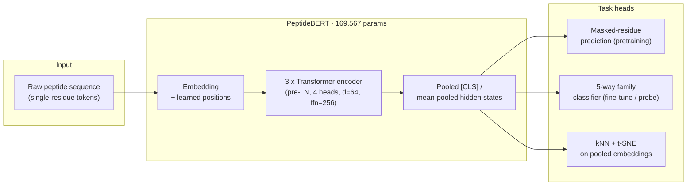

<p align="center">
  
</p>

<h3 align="center">Single-sequence language modelling learns family-defining structure<br/>in plant signalling peptides</h3>

<p align="center">
  Vomo-Donfack, K.L. · Aberbache, M. · Cantez, A. · Hozsu, A. · Ginot, G. · Doblas, V.G. · Morilla, I.
</p>

<p align="center">
  <a href="LICENSE"></a>
  <a href="https://www.python.org/downloads/"></a>
  <a href="requirements.txt"></a>
  <a href="https://github.com/MorillaLab/PeptideBERT/actions"></a>
  <a href="https://github.com/MorillaLab/PeptideBERT/stargazers"></a>
  <a href="https://github.com/MorillaLab/PeptideBERT/issues"></a>
  <a href="#citation"></a>
</p>

<p align="center">
  <b>169,567 parameters</b> · <b>zero deep-learning dependencies</b> (NumPy only) · <b>4 peptide families + 1 decoy class</b> · fully reproducible, seed-fixed pipeline
</p>

---

A 169K-parameter transformer, trained from scratch on nothing but raw plant peptide
sequences, learns to tell **RALF** apart from **CLE**, **PSK**, and **PEP** — and knows
when a sequence is structureless noise — without ever seeing an alignment, a structure,
or a label. This repository is the reference implementation.

## Why this exists

Every current plant small-signalling-peptide (SSP) classifier — including the
best-performing ones — leans on embeddings from **generalist** protein language models
(ESM-2 and friends) trained on sequence space at large. Nobody had checked what happens
if you instead pretrain **directly and only** on the peptide family you care about, at a
scale (hundreds, not millions, of sequences) that's actually realistic for a niche plant
hormone family. This is that check.

## Headline results

| Evidence | Random-init backbone | **Pretrained PeptideBERT** |
|---|---:|---:|
| Masked-residue accuracy (chance ≈ 5%) | 5.1% | **18.0%** |
| kNN family accuracy, full corpus (chance 20%) | 82.0% ± 5.4% | **98.0% ± 1.2%** |
| kNN family accuracy, length-matched band (n=148) | 83.1% ± 6.0% | **97.2% ± 5.5%** |
| Linear-probe classification (70-epoch checkpoint) | 90.0% | **93.3%** |
| Attention-to-motif variability across heads (s.d.) | 0.007 | **0.078** |

Every real family lights up above chance under masking; a synthetic i.i.d. decoy class
stays at chance — the model isn't just confident, it's confident *specifically where
sequence structure actually exists to support it*. See [Results & figures](#results--figures)
and the manuscript for the full picture, including the two methodological corrections
(a length-confounded corpus, and an under-converged 30-epoch pretraining run) reported
transparently rather than smoothed over.

## Tokenisation

20 canonical amino acids plus an ambiguity token (X) and five special tokens ([PAD], [UNK],[MASK], [CLS], [SEP]). `[CLS]` stands for **classification token**, and `[SEP]` for **separator token**

**`[CLS]`** gets prepended to the very start of every sequence. The idea: because self-attention lets every position attend to every other position, this token's final-layer representation ends up aggregating information from the whole sequence — so it becomes a natural summary vector to pool from for sequence-level tasks. That's exactly how we used it: in `model.py`'s `classify_logits`, we take `hidden[:, 0, :]` — position 0, always the `[CLS]` token — and feed that straight into the family-classification head, rather than pooling over all positions.

**`[SEP]`** marks a boundary. In BERT's original use case, it separates two distinct segments when you feed in a sentence pair (`[CLS] sentence A [SEP] sentence B [SEP]`, for tasks like question-answering). We never feed in sequence pairs — every input is one peptide — so `[SEP]` in our code does the simpler job of just marking "end of sequence," appended once after the last real residue and before any padding.

Worth contrasting with `[MASK]` and `[PAD]`, since all four show up together in `peptide_data.py`: `[MASK]` is the one actually doing work during pretraining (it's what gets predicted); `[PAD]` just fills unused positions in a batch and gets masked out of attention entirely. `[CLS]` and `[SEP]` are structural — they don't get predicted or hidden, they just give the model fixed reference points to anchor a "start of sequence" and "whole-sequence summary" representation to.

## Architecture



Implemented **from scratch in NumPy** — model, transformer blocks, and a hand-rolled
reverse-mode autodiff engine, every primitive of which is validated against
finite-difference gradient checks (max abs error < 3x10^-4). No PyTorch, no JAX.

## Quickstart

```bash
git clone https://github.com/MorillaLab/PeptideBERT.git
cd PeptideBERT
pip install -r requirements.txt

# Reproduces the full corpus, both pretraining checkpoints (30- and 70-epoch),
# all four fine-tuning/linear-probe regimes, and every figure - one fixed seed (0).
python3 run_all.py
```

Outputs land in `results/json/` (raw numbers behind every statistic in the manuscript)
and `results/figures/` (Figs. 1-6, regenerated on demand).

## Repository layout

```
PeptideBERT/
├── data/
│   ├── raw/            # RALF (Q9SRY3) & CLE (Q9XF04) seeds; PSK/PEP motif scaffolds
│   └── processed/      # Augmented 300-seq corpus, 240/60 split, length-matched band
├── src/                # Model, autodiff engine, MLM pretraining, fine-tuning, eval
├── checkpoints/
│   ├── pretrained_30epoch/    # Pre-extension checkpoint (documented discrepancy)
│   ├── pretrained_70epoch/    # Headline checkpoint
│   └── random_init/           # Identically initialised, never-trained control
├── results/
│   ├── json/            # Every number behind every figure/statistic
│   └── figures/         # Rendered Figs. 1-6
├── configs/             # Pretraining / fine-tuning / architecture hyperparameters
├── notebooks/           # Exploratory walkthroughs
├── tests/               # Gradient checks + model sanity tests
├── assets/              # README/banner assets
├── run_all.py           # One command, full reproduction, seed = 0
└── requirements.txt
```

> **Status:** repository populated with module-level documentation; implementation,
> data, and checkpoint artefacts to be added prior to tagging a release.

## Method, in four moves

1. **Calibrate, don't just elevate** - masked-residue confidence is checked against a
   synthetic decoy class engineered to be genuinely unpredictable, not just against chance.
2. **Prove it isn't length or amino-acid composition** - a dedicated length-matched
   band (75-105 aa, all 5 classes) where a length-only classifier sits at chance (24.4%)
   is the precondition for every downstream comparison.
3. **Cross full fine-tuning with a frozen linear probe** - disentangles what
   pretraining itself contributes from what gradient descent can paper over.
4. **Open the box** - gradient-based saliency and per-head attention-to-motif analyses
   show pretraining produces a genuine division of labour among heads, not just a
   uniform confidence bump.

## Data

Only RALF and CLE are literature-verified reference sequences (UniProt `Q9SRY3`,
`Q9XF04`); PSK and PEP are illustrative scaffolds built around literature-reported
conserved motifs; the decoy class is synthetic by construction. The corpus (300
sequences), model (169,567 parameters), and single training run are sized for a
**feasibility study**, not a benchmark claim - see the manuscript's Discussion and
Limitations for the full accounting, including what a 30-vs-70-epoch pretraining
comparison did and didn't resolve.

## Results & figures

| Fig. | What it shows |
|---|---|
| 1 | Pretraining loss & accuracy, 30 -> 70 epochs |
| 2 | Held-out accuracy vs. pseudo-perplexity, pretrained vs. random-init, by family |
| 3 | t-SNE of pooled embeddings - pretrained vs. random-init vs. dipeptide baseline |
| 4 | Fine-tuning curves (4 regimes) + kNN vs. baselines, full corpus and length-matched |
| 5 | Gradient-based saliency at masked positions |
| 6 | Attention-to-conserved-motif, by layer and head |

## Roadmap

- [ ] Structural downstream task (RALF-LRX contact/interface prediction) via
      AlphaFold-modelled complexes
- [ ] Replicate the 30-vs-70-epoch pretraining comparison across multiple seeds
- [ ] Test whether PeptideBERT embeddings add value **on top of** ESM-2 in a
      production pipeline (e.g. S2-PepAnalyst), rather than replacing it
- [ ] Expand the literature-verified reference set beyond RALF/CLE

## Citation

If you use this code or data, please cite the manuscript (see [`CITATION.cff`](CITATION.cff)):

```bibtex
@article{vomodonfack2026peptidebert,
  title   = {PeptideBERT: single-sequence language modelling learns family-defining
             structure in plant signalling peptides},
  author  = {Vomo-Donfack, K.L. and Aberbache, M. and Cantez, A. and Hozsu, A.
             and Ginot, G. and Doblas, V.G. and Morilla, I.},
  year    = {2026},
  url     = {https://github.com/MorillaLab/PeptideBERT}
}
```

## Contributing

Issues and PRs are welcome - see [`CONTRIBUTING.md`](CONTRIBUTING.md).

## License

[GPL-3.0](LICENSE)
